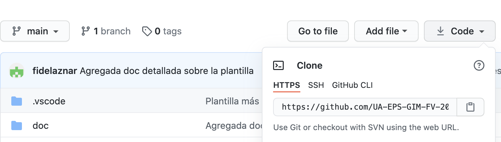

# Antes de nada
Estos son los prerequesitos antes de gastar la plantilla. Debes tener conocimientos básicos de:

* **git**: conocer como mínimo y estar familiarizado con los comandos commit, add, push, pull, tag, merge y branch. Si no sabes nada de git te recomiendo que le eches un vistazo rápido antes de empezar a : https://david-estevez.gitbooks.io/the-git-the-bad-and-the-ugly/content/es/control-de-versiones.html

* **markdown**: saber escribir un fichero en markdown con formato básico. Saber incluir imágenes en dicho fichero. Es muy sencillo, con la entrada de la wikipedia podéis saber los tags básicos: https://es.wikipedia.org/wiki/Markdown

* **vscode**: probar el entorno y leer algún tutorial básico para aprender como usarlo. 

## Recomendable
* **cmake**: tener conocimientos para que sirve y leves de que es el fichero `CMakeLists.txt`. Saber como genera *cmake* un ejecutable y hacer una mini prueba en tu equipo

# Cómo obtener la plantilla

La plantilla se debe obtener desde terminal mediante 

~~~ 
git clone <url_https_de_tu_repositorio>
~~~
La url se obtiene desde el repositorio del grupo así:

# Documentación

**Tened en cuenta que las intrucciones de la plantilla están aquí:** 
[documentación_compilada](doc/plantilla_doc.html). Existen más documentos a leer en la carpeta `doc`. ¡Échales un vistazo!