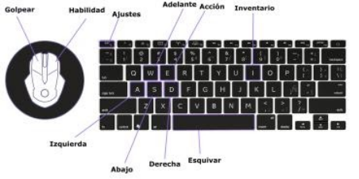
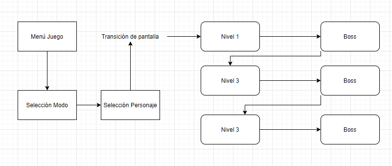

# Game Design Document

*Se debe rellenar progresivamente con respecto al desarrollo del juego. El diseño del juego debe estar en las sesiones iniciales.*

## TEN SHEET - LOST 
### Autores:
- *Elizabeth Itati Balbín Medina*
- *Beatriz Gámez Nortes*
- *Alejandro Gómez López*
- *Damián Llorente Gutiérrez*
- *Ginés Martínez Gracia*

## 1. FICHA DEL JUEGO
### Póster del juego

### 1.1 Título del juego
El título del juego es LOST desarrollado por Stamina Studios.

### 1.2 Sistema de juego
El sistema básico del juego consiste en un personaje principal que se encuentra en una habitación con varias puertas/salidas que conducirán a la sala final del boss. Para acceder a ellas se deberá conseguir unas habilidades  que podrá obtener a través de la tienda y derrotando enemigos en las salas. 

### 1.3 Público al que va dirigido
El juego tendría está dirigido a un público a partir de 7 años ya que contempla temática de terror que podrían asustar a los niños más pequeños, además de que tiene violencia implícita.
Además, este juego está pensado para aquellos que sientan debilidad por los juegos 2D que presentan una nueva experiencia de juego cada vez que empiezas una partida.

### 1.4 Resumen de la historia del juego orientada a la jugabilidad
El juego está orientado a un juego de plataformas que combina dos perspectivas: top-down camera y side camera. En la top-down se enfocará el mapa en el que se encuentra el jugador para mostrar en detalle el mapa al jugador, mientras que en la perspectiva tipo side se mostrará al jugador las batallas con los enemigos para dar una impresión de 

### 1.5 Distintos modos de juego
Modo **Single Player** y modo **Hardcore**.

### 1.6 Puntos únicos de vuestro juego: cinco mínimo que destacan a vuestro juego del resto
 
- Historia
- Selección de diferentes personajes y variedad de enemigos
- Ambientación 
- Cambio de la perspectiva de la cámara en ciertos escenarios
- Construcción procedural del mapa
- Posibilidad de completar “quests” con diferentes NPCs para conseguir recompensas.

### 1.7 Juegos parecidos
 
- The Binding of Isaac
- Hades 
- The Legend of Zelda: Link's Awakening 
- Dead Cells

- Moonlighter

## 2. ÁMBITO Y JUGABILIDAD
### 2.1 Jugabilidad
#### 2.1.1 Cómo se progresa en el juego
En el juego el jugador deberá completar un nivel para pasar al siguiente derrotando al jefe de dicho nivel. En cada uno de los niveles el jugador podrá comprar en la tienda objetos que mejoren sus “stats” o cambiar a mejores armas; mediante monedas que podrá conseguir completando las “quests”.

#### 2.1.2 Misiones y estructura de retos
La misión principal del juego es conseguir escapar de la mazmorra en la que está encerrado nuestro personaje. A su vez, aparecerán una serie de NPC’s que nos darán la opción de completar una serie de quests o misiones opcionales para poder conseguir tanto dinero como algún objeto especial.

El reto principal de cada nivel sería derrotar a un jefe final para poder superar el nivel y poder avanzar al siguiente. También habrá retos opcionales que serán necesarios para superar las quests de los NPC’s.

## 3. INTERFAZ
### 3.1 Sistema visual
#### 3.1.1 HUD y controles

El HUD del juego se compondrá de: 

- Una barra roja que indique la vida del personaje.
- Una barra azul con la magia del personaje.
- Un número que indique el número de monedas que tiene
- Un número que nos indique el nivel en el que nos encontramos (5 al 1). 

En cuanto a los controles vista cenital:

- **W** - Moverse hacia delante.

- **A** - Moverse hacia la izquierda.

- **S** - Moverse hacia abajo.

- **D** - Moverse hacia la izquierda.

- **Espacio** - Esquivar. 

En cuanto a los controles vista lateral:

- **A** - Moverse a la izquierda.

- **D** - Moverse a la derecha.

- **Espacio** - Esquivar. 

En cuanto a los controles generales: 

- **E** - Acción.

- **Click Izquierdo** - Golpear.

- **Click Derecho** - Habilidad.

- **I** - Inventario.

- **Esc**  Reanudar, Ajustes, Salir de la partida.

#### 3.1.2 Menús
 
- Nueva partida
- Modo de juego
    - Modo fácil
    - Modo difícil
- Opciones
    - Controles
    - Resolución
- Salir del juego

#### 3.1.3 Características Motor 2D
En cuanto a motor 2D vamos a emplear SFML (Simple and Fast Multimedia Library) que es una biblioteca multimedia cuyas funcionalidades serán las siguientes:
 
- Gestión de personajes
- Múltiples capas de mapas
- Capas para configurar: elementos, objetos, colisión.
- Sonido
- Gestión de cuadros de diálogo.
- Gestión de Sprites.
- Gestión de tipografía.
- Música de fondo.
- Transición de nivel.

#### 3.1.4 Cámara
La cámara será vista cenital y de perfil.

### 3.2 Sonido
La música tendrá una ambientación 8bit de temática misteriosa-fantástica.

## 4. MECÁNICA
### 4.1 Reglas del juego explícitas e implícitas
El mapa del juego será dinámico y tendrá 2 vistas, cenital y de perfil que cambiará cuando el jugador se meta en una sala secreta, mientras tanto seguirá con la vista cenital.

#### 4.1.1 Física
Las físicas que habrán en el juego serán, principalmente, colisiones con las distintas paredes que haya en la sala.

También se aplicará la fuerza de la gravedad para que ni los personajes ni los objetos del entorno estén flotando en el aire.

#### 4.1.2 Movimiento
Especificado en el punto **3.1.1**
#### 4.1.3 Objetos (como se cogen, mueven..)
#### 4.1.4 Acciones
 
- Accionar interruptor para abrir puerta.
- Hablar con NPC de la tienda.
- Hablar con NPC para la quest.
- Abrir cofre.
- Usar llave.
- Coger objetos.

#### 4.1.5 Economia
La economía del juego girará en torno a monedas que nuestro personaje irá recolectando a medida que mate enemigos o realice diferentes quest.
Estas monedas podrán ser utilizadas en la tienda para comprar diferentes 'upgrades' que mejorarán nuestros stats.

### 4.2 Transición de pantallas
#### 4.2.1 Diagrama de transición de pantallas

#### 4.2.2 Descripcion de las pantallas
Consejos para que el jugador entienda mejor el juego
#### 4.2.3 Menús 

**Menú pausa(ESC):**
 
- Reanudar
- Opciones
    - Gráficos
    - Sonidos
    - Controles
- Salir

#### 4.3 Opciones del juego: cuales son y cómo afectan a la mecánica
 
 - **Modo Single Player:** Modo historia principal en el que el objetivo es superar la mazmorra.
 - **Modo Hardcore:** Modo historia principal pero con una sola vida, si mueres tienes que volver a empezar.

#### 4.4 Rejugar y salvar
Nuestro dijo dispondrá de un guardado automático cada vez que el personaje supere la sala, se indicará con una animación.
#### 4.5 Trucos y Easter Eggs
Al realizar cierta acción, como salir y entrar en una sala varias veces seguidas sin motivo cambiará el lobby inicial.

## 5. HISTORIA, CARACTERÍSTICAS Y PERSONAJES
### 5.1 Historia
#### 5.1.1 Historia de fondo
Eres un niño/elfo que se encuentra en lo más profundo de la mazmorra, siempre ha vivido dentro y no conoce que hay en el exterior, así que queriendo saber lo que hay más allá de su lugar natal, toma cartas en el asunto e intenta escapar.
#### 5.1.2 Elementos principales
Los elementos principales son:
 
- La tienda

  - La zona de cambio de armas

  - El personaje principal

  - Los NPCs que nos proporcionan quest

#### 5.1.3 Progresión del juego
Al ser un roguelike no tenemos progresión fuera de lo que podamos conseguir en cada run.
#### 5.1.4 Escenas de animación
Pueblo - Justo al empezar el juego

### 5.2 Mundo del juego
#### 5.2.1 Apariencia del juego
Mundo subterráneo, mazmorra con salas y mobs agresivos.
#### 5.2.2 Área 1

**I. Descripción**

Spawn, lobby, principal: Sala no hostil, donde apareceremos y será el inicio de cada sala (con algún cambio por nivel) donde podremos encontrar la tienda y algún npc con el que interactuar.

**II. Características físicas**

Sala simple con NPCs no hostiles (friendly).

**III. Niveles que usan este área**

Todos.

**IV. Conexión con otras áreas**

Al área 2 (la mazmorra).

#### 5.2.3 Personajes
**Protagonista:** Es un habitante de la mazmorra, quiere salir para descubrir que hay fuera de ella.

En cuanto a apariencia, contaremos con 4 posibilidades:

- Un humano - Dan

- Una humana - Lyssandra

- Un elfo - Ion

- Una elfa - Idryl

Los sprites de estos personajes estarán predefinidos y no se podrán modificar.

Las animaciones serán:
 
- Andar

- Esquivar

- Atacar

Tendrá habilidades especiales, pero estas estarán ligadas a las armas.
Al ser el personaje principal, contaremos con él a lo largo de todo el juego y en el que recae todo el peso de la historia.

Relaciones con otros personajes:

- ***Tendero:*** Le comprará las mejoras además de ser el personaje que le guíe un poco por la historia
- ***NPC de quest:*** El protagonista ayudará a este personaje para conseguir mejoras
- ***Enemigos:*** Luchará con ellos para avanzar en el juego

Estadísticas: Depende del personaje que elijas al empezar:
 
- ***Humano:*** Tendrá mayor daño físico que daño mágico. Tendrá mayor vida
- ***Elfo:*** Tendrá mayor daño mágico que daño físico. Tendrá menor vida

>**Tendero:** Este personaje le contará a nuestro protagonista el progreso que 
que ha conseguido además de proporcionarle mejoras a cambio de monedas.

>**NPC quest:** Es un personaje en apuros que le suplicará al protagonista para que le ayude en algún que otro problema. A cambio de superar estas misiones, le dará dinero o mejoras al personaje principal.

**Enemigo**

**1. Historia de fondo**

Un enemigo que merodea por la mazmorra y que dificulta el avance del protagonista.

**2. Apariencia**

Tendremos cinco tipos de enemigos diferentes:
 
- Orcos
- Brujas
- Mimic
- Esqueleto
- Dragón
    
Exceptuando el dragón, los enemigos tendrán colores distintos en base a sus estadísticas, siendo el verde el más fácil de derrotar y el rojo el más difícil.

Los sprites de estos personajes estarán predefinidos y no se podrán modificar.

Las animaciones serán:
 
- Andar
- Atacar
    
Las estadísticas base son:
 
- Orco
    
    - Vida: **+++**
    - Daño: **++**
    - Velocidad: **+**

- Brujas 
    
    - Vida: **+**
    - Daño: **++**
    - Velocidad: **++**

- Mimic
    
    - Vida: **++**
    - Daño: **+++**
    - Velocidad: **+**

- Esqueleto
    
    - Vida: **+**
    - Daño: **+**
    - Velocidad: **++**

- Dragón:
    
    - Vida: **++++++**
    - Daño: **++++++++**
    - Velocidad: **+++++**
    
>Los *"+"* significan estadísticas que están aún por definir, es una guía para indicar cuáles van a tener más daño o más vida.

## 6. NIVELES

### 6.1 Resumen

Habrá tres niveles, cada uno con una temática que hará que cambie visualmente:

- Primer nivel: Gruta cristales

- Segundo nivel: Gruta normal

- Tercer nivel: Bosque

### 6.2 Material de introducción: animación...
Introduciremos una primera animación al principio del juego que se vea al protagonista yendo hacia la mazmorra.

### 6.3 Objetivos

Subir niveles (pisos) y escalar derrotando a bosses en cada planta para llegar al objetivo final.

### 6.4 Descripción física

Dependiendo del nivel en el cual nos encontremos la escena será distinta, en el primer nivel encontraremos una mazmorra con estilo infierno a medida que avanzamos el diseño será un poco más de superficie, habrá tierra, vegetación, etc...

### 6.5 Mapa
El mapa se basará en una sala inicial céntrica donde encontramos la tienda y en esta misma varios caminos hacia los laterales que llevan a los niveles hostiles de la mazmorra, estas a su vez se dividirán entre más salas.

### 6.6 Caminos

Se generan aleatoriamente, por lo tanto no tenemos un camino predeterminado. Lo que sí tenemos es una zona central desde la cual saldrán las diferentes salas y la sala del boss.

### 6.7 Encuentros: emboscadas

Cada vez que nos encontremos en una sala habrá un número determinado de enemigos que aparecerán cuando nosotros entremos.

### 6.8 Guia de nivel

Avanzar a matando mobs hasta encontrar la llave del nivel que te permite abrir la mazmorra del boss

### 6.9 Material de cierre

El cierre lo determinas tú, bien puedes conseguir la llave y lanzarte directamente hacia el boss de la sala o puedes seguir explorando en busca de más objetos u oro.

## 7. INTELIGENCIA ARTIFICIAL

Diferentes tipos de enemigo, y dependiendo de cada uno o se moverá o atacará de una manera distinta, como por ejemplo ataque a mele o con un proyectil, o en el caso del movimiento o te persigue o se mueve siguiendo una ruta de izquierda a derecha.

## 8. DISEÑO SOFTARE

En cuanto al diseño del software hemos utilizado SFML, C++ y Github.

## 9. MOTORES

En cuanto al motor se han implementados las clases Srite y Textura.

## 10. DIRECCIÓN Y PLANIFICACIÓN
### 10.1 Ejecutables a entregar
         
#### HITO 1
- Movimiento con ataque
- Animaciones
- Carga de mapas con Tiled
- Carga de salas aleatorias
- Colisiones
        
### Funcionalidades y responsables
         
- **Cámara (10h) - Damián**
    
- Creación de las 2 cámaras (cenital y de perfil)
- Movimiento de la cámara
        
- **Cargado de recursos (120h) - Beatriz y Ginés**
        
    - Cargar gráficos
            
        - Cargado de imágenes de sprites
        - Carga de música (5h) - **Damián**
    
- **Generación de mapas  (160h) - Elizabeth y Alejandro**
        
    - Mapas predefinidos/estáticos
    - Mapas aleatorios
    
    - **Movimiento del personaje (20h) - Beatriz y Ginés**
        
    - Cambio de sprites según la vista
    
- **Colisiones (80h) - Beatriz y Ginés**
        
    - Detectar colisión con objetos sólidos
    - Decidir qué acción se ejecuta cuando se produce una colisión
    
- **IA (80h) - Elizabeth y Alejandro**
        
    - Comportamiento
            
        - De los diferentes enemigos
        - Disponibilidad de un personaje, acciones que puede desencadenar según el movimiento que actúe sobre él
        - Batalla final contra una entidad cuyo comportamiento está completamente basado en el propio jugador (movimientos)
        
    - Máquina de estados
            
        - Número de estados
        - Número de transiciones entre estados que indican un cambio de estado, descritas por una condición que debe cumplirse y un conjunto de acciones que deben realizarse dentro de cada estado
        
    - Árbol de decisiones

    - Pathfinding
            
        - Run, success o failure
    
- **Implementación Mimic (10h) - Damián**
    
- **Interfaz (35h) - Damián y Elizabeth**
     
    - Menú de inicio
    - Menú de opciones de juego
    - Menú de pausa
    - Menú de ayuda (Controles)
    - HUD
    
- **Interacción con objetos (30h) - Damián**
    - El botón de acción es la **“e”** que servirá para:
            
        - Accionar palancas o botones
        - Hablar con NPCs
        - Acceder a la tienda
    
- **Inventario y tienda (20h) - Damián**
        
    - Organización tienda por nivel
    - Inventario personaje principal
